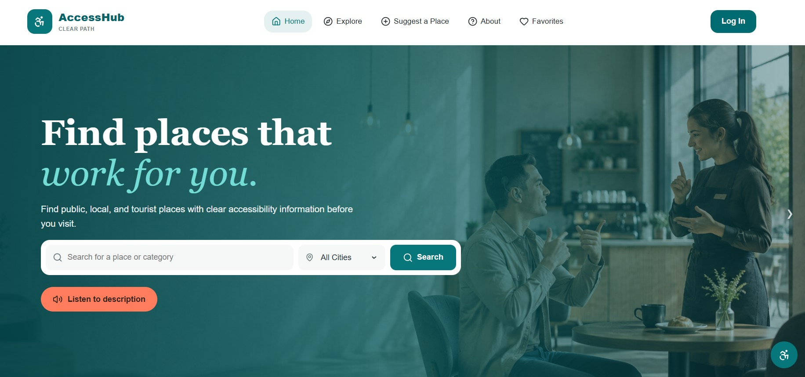
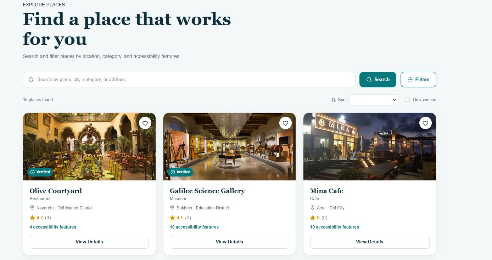
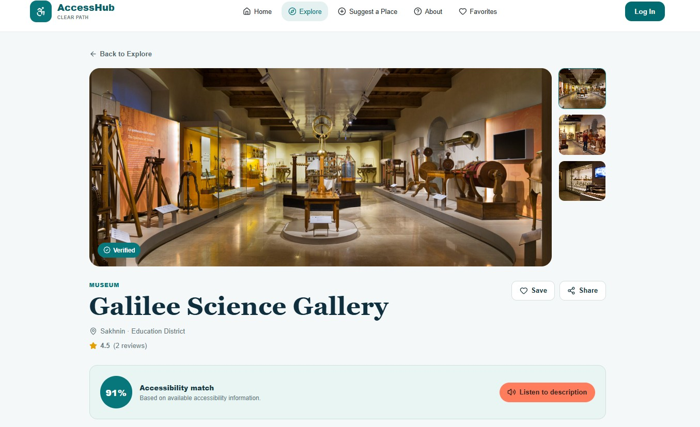
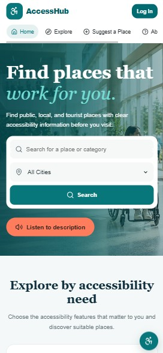

# AccessHub ♿

AccessHub is an accessibility-focused web application that helps users discover public places based on their accessibility needs.

Users can explore places, review accessibility information, save favorites, share reviews, report incorrect information, and suggest new locations. Administrators can manage and verify platform content through a protected admin dashboard.

## ✨ Features

### For Users
- Browse and search accessible places
- Filter places by accessibility needs
- View detailed accessibility information
- Save favorite places
- Submit ratings and reviews
- Report incorrect or outdated information
- Suggest new places
- Manage accessibility preferences
- Text-to-speech support
- Responsive desktop, tablet, and mobile experience

### For Administrators
- Secure administrator authentication
- Add and edit places
- Verify accessibility information
- Delete places
- Manage user reviews
- Review community reports
- Approve or reject place suggestions

## 📸 Screenshots

### Home Page



### Explore Places



### Place Details



### Mobile Experience

<p align="center">
  
  &nbsp;&nbsp;
  
</p>

## 🛠️ Technologies

- React
- Vite
- React Router
- Firebase Authentication
- Cloud Firestore
- Lucide React
- React Toastify
- CSS

## 🔐 Authentication & Security

AccessHub uses Firebase Authentication for user and administrator authentication.

Firestore Security Rules protect application data and restrict administrative operations based on authenticated user roles.

Regular users are assigned the `user` role, while administrative functionality requires an authenticated account with the `admin` role.

## ♿ Accessibility

Accessibility is a core part of AccessHub.

The interface includes support for:

- Keyboard navigation
- Visible focus states
- Readable color contrast
- Responsive layouts
- Screen-reader-friendly structure
- Accessibility preference selection
- Text-to-speech functionality
- Mobility, vision, hearing, sensory, restroom, and parking accessibility information

## 🚀 Getting Started

```bash
git clone YOUR_REPOSITORY_URL